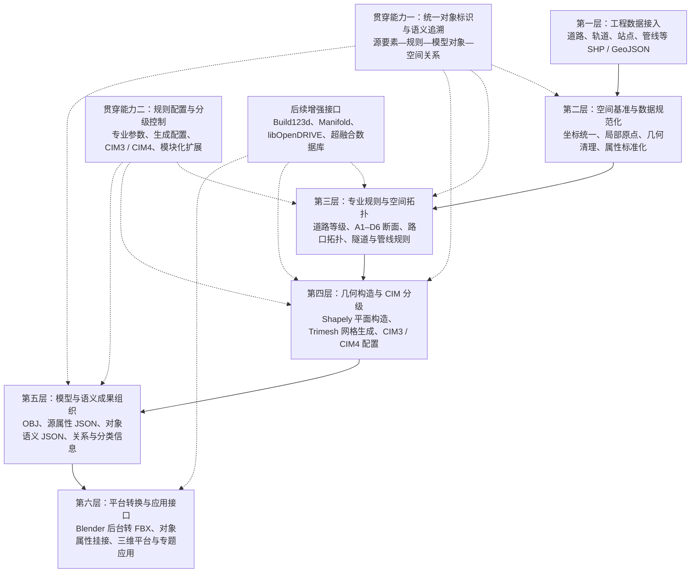

# CIM 自动化建模实施技术路线框架

## 一、框架定位

本框架依据当前代码实际实现形成，核心目标是：

> 以工程 GIS 数据为基础，以专业规则和空间拓扑计算为核心，同步生成 CIM3/CIM4 三维对象与语义数据，并通过标准成果接口支撑三维平台、超融合数据库和数字孪生应用。

当前实施主线不是由 Blender 直接完成自动建模，而是：

> Python 负责数据、规则、拓扑和几何生成，Blender 负责后台成果转换与三维平台适配。

---

## 二、总体技术框架



如果 PPT 软件无法直接使用 Mermaid，可按“六层纵向架构＋两条侧向贯穿能力＋底部扩展接口”重新绘制。

---

## 三、六层实施架构

### 第一层：工程数据接入层

#### 主要职责

- 接入道路、轨道、站点、管线等工程 GIS 数据；
- 支持 SHP、GeoJSON 等矢量数据格式；
- 支持预设数据源和自定义文件路径；
- 读取几何信息和源数据属性；
- 保留源图层、源要素和字段信息。

#### 当前代码对应能力

- 道路中心线数据接入；
- 轨道线路及站点数据接入；
- 供水、污水、燃气等管线数据接入；
- 公交站点数据接入；
- 数据图层自动发现和指定路径读取。

#### 页面关键词

> 多源接入、源属性保留、模块化数据入口

---

### 第二层：空间基准与数据规范化层

#### 主要职责

- 判断并统一源数据坐标系统；
- 将工程数据统一至 EPSG:4547；
- 计算项目范围中心，建立局部建模原点；
- 将全局 GIS 坐标转换为局部模型坐标；
- 清理无效、空缺和不符合要求的几何；
- 统一对象名称、类型、编码和基础属性。

#### 当前代码对应能力

```text
源 GIS 坐标
  → EPSG:4547
  → 计算项目局部原点
  → 几何平移本地化
  → 保留 origin_xy 用于空间还原
```

道路数据还会进一步统一：

- 道路标识；
- 道路名称；
- 道路等级；
- 车道数；
- 道路宽度；
- 单双向信息；
- 高程和桥梁信息；
- 原始属性字段。

#### 页面关键词

> 统一坐标、局部原点、属性规范化、空间可还原

---

### 第三层：专业规则与空间拓扑层

#### 主要职责

- 将工程标准和专业知识转化为可执行规则；
- 根据源数据属性匹配对象类别和生成参数；
- 识别道路、轨道和管线的空间组织关系；
- 为几何生成提供断面、构件、位置和连接规则。

#### 道路规则

- 道路等级规则；
- A1–D6 道路断面规则；
- 车道数和车道宽度；
- 主车道、辅路、非机动车道和停车带；
- 中央分隔带、侧分带、设施带、绿化带和人行道；
- 路缘石、标线、路灯和树木等附属构件；
- 路口等级、道路优先级和空间层级。

#### 路口拓扑

- 道路端点捕捉；
- 中心线真实相交；
- 道路走廊交叉；
- 道路面有效重叠；
- 路口节点聚类；
- 路口道路臂、车道连接和转向关系；
- 道路构件在路口范围内的裁剪与连接。

#### 区间隧道规则

- 线路走向和区间识别；
- 隧道断面和埋深；
- 并行线路横向错位；
- 隧道结构、轨道、疏散、机电和通信专业系统；
- 连续构件与固定间距构件的布置规则。

#### 地下管线规则

- 管线类型；
- 管径解析；
- 覆土深度；
- 管线中心高程；
- 材质和流动类型；
- 管段及节点语义。

#### 页面关键词

> 专业规则、断面配置、拓扑识别、关系驱动

---

### 第四层：几何构造与 CIM 分级层

#### 主要职责

- 将专业规则转化为平面几何和三维网格；
- 处理道路、路口、隧道和管线的空间形态；
- 通过生成配置控制 CIM3/CIM4 表达深度；
- 保证几何对象与规则及源数据保持对应。

#### 平面空间构造

主要采用 GeoPandas 和 Shapely 完成：

- 中心线偏移；
- 断面构件沿线扫掠；
- 多边形缓冲；
- 并集、交集和差集；
- 路口冲突区构造；
- 道路构件裁剪；
- 人行道、设施带和绿化带连接；
- 线路合并、分段和空间关系判断。

#### 三维网格生成

主要采用 Trimesh 完成：

- 平面多边形三角化；
- 顶面网格和拉伸实体生成；
- 圆柱、箱体和基础参数化构件生成；
- 道路构件网格分层；
- 隧道断面沿线路生成；
- 管线沿线段生成；
- 多对象场景组织和 OBJ 输出。

#### CIM3/CIM4 分级方式

当前道路 CIM3 与 CIM4 共享同一套：

- 数据基础；
- 道路断面规则；
- 道路拓扑；
- 路口识别；
- 路口构造；
- 对象语义。

两级模型主要通过生成配置控制构件深度：

| 层级 | 当前道路表达 |
|---|---|
| CIM3 | 道路主体、断面构件层、路口及基础关系；不生成路缘石、纵向车道标线和道路资产。 |
| CIM4 | 在 CIM3 基础上增加路缘石、纵向标线、路灯、树木及更完整的构件级表达。 |

轨道交通区间隧道当前采用 CIM4 规则生成，包含结构、轨道、疏散、机电和通信等专业构件配置。

#### 页面关键词

> 平面拓扑、规则扫掠、网格生成、分级配置

---

### 第五层：模型与语义成果组织层

#### 主要职责

- 同步输出几何成果和语义成果；
- 建立模型对象与源数据之间的追溯关系；
- 表达对象分类、构件组成和空间关系；
- 为后续数据库和数字孪生接入保留结构化信息。

#### 当前成果类型

1. **几何模型**
   - CIM3/CIM4 OBJ；
   - 道路、隧道等专业模块文件；
   - 按道路和构件图层组织的模型对象。

2. **源数据属性**
   - 保留原始 GIS 字段；
   - 记录源要素索引和来源信息；
   - 支持由模型对象回溯至源数据。

3. **对象语义**
   - 对象标识；
   - 对象类型；
   - 道路名称和等级；
   - 断面编码；
   - 构件类别；
   - 空间层级；
   - 模型层级。

4. **关系语义**
   - 路口节点；
   - 道路臂；
   - 车道连接；
   - 转向关系；
   - 构件对应关系；
   - 隧道线路及专业系统关系。

5. **模型对象属性**
   - 对象名称；
   - 图层名称；
   - 来源对象；
   - 构件类型；
   - 分类及空间属性。

#### 当前关联方式

```text
源 GIS 要素
  → 规则化对象记录
  → OBJ 模型对象名称
  → JSON 侧车文件
  → FBX 自定义属性
```

#### 页面关键词

> 几何语义同步、源数据追溯、对象关系、结构化成果

---

### 第六层：平台转换与应用接口层

#### 主要职责

- 将规则生成成果转换为通用三维格式；
- 设置三维对象材质；
- 将语义属性挂接到模型对象；
- 支撑不同三维平台和后续应用使用。

#### Blender 当前职责

- 后台导入 OBJ；
- 按对象或图层设置材质；
- 读取模型对象属性 JSON；
- 将属性写入 Blender/FBX 自定义属性；
- 按 CIM3/CIM4 和专业模块导出 FBX。

#### Blender 当前不承担

- 不负责核心道路规则；
- 不负责道路断面匹配；
- 不负责路口拓扑识别；
- 不负责主要三维几何的交互式人工建模；
- 不作为核心业务数据存储。

#### 应用接口

当前 OBJ、FBX 和 JSON 成果可进一步用于：

- Blender；
- Unity；
- Unreal Engine；
- CityEngine；
- 城市级三维场景；
- 超融合数据库对象接入；
- 数字孪生专题应用。

#### 页面关键词

> 后台转换、属性挂接、平台适配、应用接口

---

## 四、两项贯穿能力

### 贯穿能力一：统一对象与语义追溯

这项能力贯穿数据接入、规则匹配、几何生成和成果输出全过程。

需要建立的核心关系为：

> 源数据要素  
> → 规则及参数  
> → CIM 数字对象  
> → 构件及空间关系  
> → 三维模型对象  
> → 数据库与专题应用对象

当前已实现：

- 源属性 JSON；
- 道路语义 JSON；
- 路口语义 JSON；
- 模型对象属性 JSON；
- 模型分类信息；
- FBX 自定义属性挂接。

后续重点：

- 建立跨专业统一对象编码；
- 建立 CIM3/CIM4 对象对应关系；
- 建立模型对象和数据库对象稳定标识；
- 建立来源、规则和版本关系。

---

### 贯穿能力二：规则配置与分级控制

当前规则由以下部分共同构成：

- 道路等级规则 JSON；
- A1–D6 断面规则 JSON；
- 道路和路口空间计算规则；
- CIM3/CIM4 生成配置；
- 隧道专业构件规则；
- 管线类型、管径和埋深规则。

后续应当由“程序中的规则”进一步转化为：

- 统一规则目录；
- 规则参数配置；
- 规则版本管理；
- 规则适用对象；
- 规则来源依据；
- 规则变更影响范围；
- 不同项目的规则组合方案。

---

## 五、当前实施能力与后续增强边界

### 当前已经形成

| 方向 | 实施情况 |
|---|---|
| 道路自动建模 | 已形成 CIM3/CIM4 两级道路、路口和道路构件生成链路。 |
| 区间隧道建模 | 已形成 CIM4 规则生成和专业系统构件配置。 |
| 地下管线建模 | 已形成依据线路、管径、覆土和类型生成管段及语义记录的模块基础。 |
| 站点建模 | 已形成公交站、地铁站点位和基础体块生成能力。 |
| 语义关联 | 已输出源属性、对象语义、路口关系、分类和模型对象属性。 |
| 成果转换 | 已实现 OBJ 到 FBX 的 Blender 后台转换及属性挂接。 |

### 后续技术增强

| 方向 | 规划能力 |
|---|---|
| 精密参数化构件 | 研究 Build123d 与现有规则链路协同，补充高精度工程实体。 |
| 复杂几何运算 | 研究 Manifold，增强复杂布尔和水密网格处理。 |
| 标准道路数据 | 评估 libOpenDRIVE，补充高精道路标准数据解析。 |
| 多专业深化 | 完善站点、管线、地下空间等对象的专业规则和构件模板。 |
| 数据资产组织 | 将当前 OBJ、FBX 和 JSON 文件关联提升为超融合数据库中的统一对象、关系、版本和服务。 |
| 专题应用 | 面向数字孪生专项形成场景、图层、指标、查询和分析能力。 |

---

## 六、PPT 一面版推荐内容

### 推荐标题

> 实施技术路线：以规则化空间计算贯通数据、模型与语义

### 页面主图

建议使用六层纵向架构：

1. 工程数据接入；
2. 空间基准与数据规范化；
3. 专业规则与空间拓扑；
4. 几何构造与 CIM 分级；
5. 模型与语义成果组织；
6. 平台转换与应用接口。

左侧贯穿：

> 统一对象与语义追溯

右侧贯穿：

> 规则配置与分级控制

底部增加：

> 后续增强：精密参数化构件、复杂布尔运算、标准道路数据、超融合数据库和数字孪生专题

### 页面核心文字

> 当前以 GeoPandas/Shapely 完成空间数据与平面拓扑处理，以 Trimesh 完成三维网格生成，以 Blender 完成后台格式转换和属性挂接；同步形成 CIM3/CIM4 模型、源数据属性及对象关系语义。

### 页面底部结论

> 核心不是单一建模工具，而是“数据标准—专业规则—空间拓扑—分级几何—对象语义—应用接口”的完整技术链路。

---

## 七、对应演讲稿

> 这张图是当前已经实施的技术框架。整体分为六层。第一层接入道路、轨道、站点和管线等工程 GIS 数据；第二层完成坐标统一、局部原点转换、几何清理和属性规范化；第三层通过道路等级、A1 到 D6 断面、路口拓扑、隧道构件和管线参数等专业规则，确定对象如何生成；第四层使用 Shapely 进行平面拓扑构造，使用 Trimesh 形成三维网格，并通过生成配置控制 CIM3 和 CIM4 的表达深度；第五层同步组织 OBJ 模型、源属性、对象语义和空间关系；第六层由 Blender 后台完成 FBX 转换、材质设置和对象属性挂接，为后续三维平台和专题应用提供通用成果。  
>   
> 其中有两项能力贯穿整个过程：一项是统一对象和语义追溯，保证模型能够回到源数据、规则和空间关系；另一项是规则配置与分级控制，保证同一套基础数据能够形成不同层级、不同专业的模型。下一阶段将在这条已实施链路上进一步增强精密参数化构件、复杂几何运算和标准道路数据能力，并将文件形式的模型与语义成果接入超融合数据库，支撑数字孪生专题应用。

